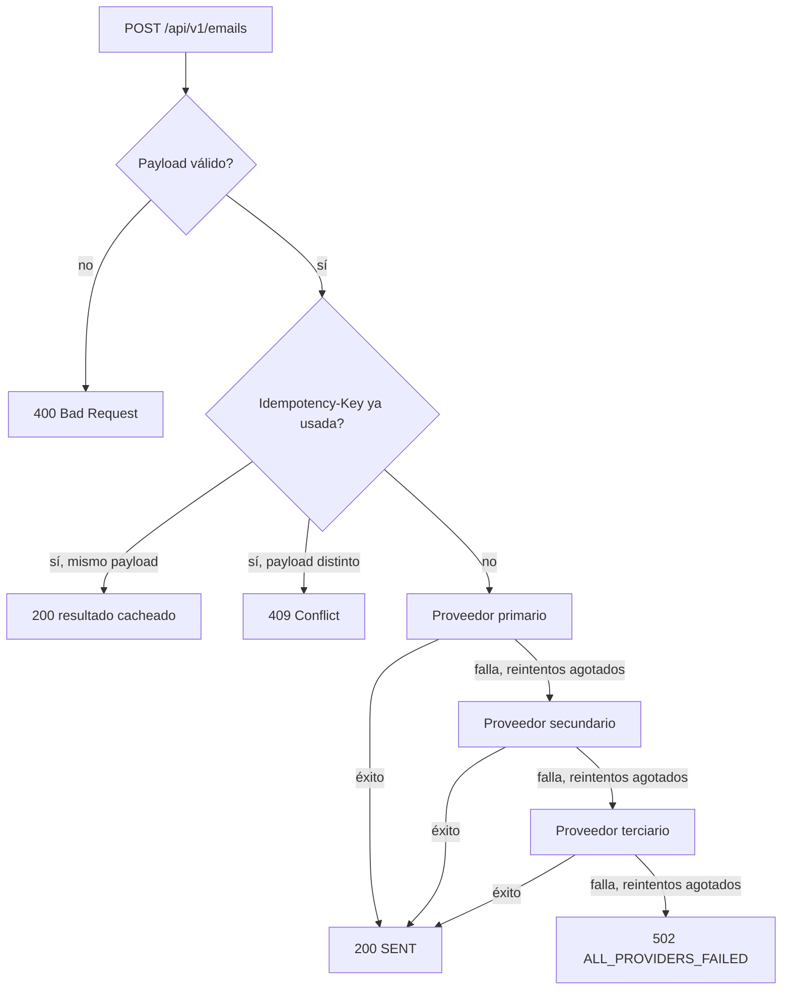

# Email Failover Service

API REST para el envío resiliente de correos electrónicos (recibos, alertas de seguridad, validaciones) en una plataforma de movilidad a gran escala. Implementa una **estrategia de failover automático** entre múltiples proveedores de email (Mailgun, SendGrid, Postmark), con reintentos y backoff exponencial por proveedor, un **circuit breaker** que deja de contactar a un proveedor caído entre peticiones, e **idempotencia** segura ante reintentos (incluso concurrentes) del cliente — todo siguiendo **Clean / Hexagonal Architecture**.

> Ninguno de los proveedores llama a un servicio real: son adaptadores *mock* configurables por variables de entorno, tal como permite el enunciado. La arquitectura está diseñada para que reemplazarlos por clientes reales (SDK de Mailgun, SendGrid, Postmark) sea un cambio localizado a `src/infrastructure/providers`, sin tocar dominio, aplicación ni la capa HTTP.

## Tabla de contenidos

- [Arquitectura](#arquitectura)
- [Estrategia de failover](#estrategia-de-failover)
- [Decisiones de diseño](#decisiones-de-diseño)
- [Cómo correr el servicio localmente](#cómo-correr-el-servicio-localmente)
- [Cómo correr con Docker](#cómo-correr-con-docker)
- [Cómo probar el failover en vivo](#cómo-probar-el-failover-en-vivo)
- [API](#api)
- [Testing](#testing)
- [Observabilidad](#observabilidad)
- [Extensibilidad: agregar un cuarto proveedor](#extensibilidad-agregar-un-cuarto-proveedor)
- [Escalabilidad y despliegue en producción](#escalabilidad-y-despliegue-en-producción)
- [Limitaciones conocidas y próximos pasos](#limitaciones-conocidas-y-próximos-pasos)

## Arquitectura

El proyecto sigue **Clean / Hexagonal Architecture**: el dominio y la lógica de negocio no dependen de ningún framework, librería HTTP ni SDK de proveedor de email. Las dependencias siempre apuntan hacia adentro.

```
src/
  domain/                 # Núcleo: entidades, value objects, puertos y errores de negocio.
    entities/EmailMessage.ts
    value-objects/EmailAddress.ts
    ports/EmailProviderPort.ts        <- interfaz que implementan los adaptadores de proveedor
    errors/{DomainErrors,ProviderErrors}.ts

  application/             # Casos de uso: orquestan el dominio, sin conocer HTTP ni proveedores concretos.
    use-cases/SendEmailUseCase.ts     <- orquesta la cadena de failover
    services/{RetryPolicy,payloadFingerprint}.ts
    ports/{Logger,EmailSendRepository}.ts   <- puertos que la aplicación necesita hacia afuera
    dto/SendEmailCommand.ts

  infrastructure/           # Adaptadores concretos: todo lo que "sabe" de un detalle externo.
    providers/              # Adaptadores de EmailProviderPort (Mailgun, SendGrid, Postmark)
    persistence/             # Adaptador de EmailSendRepository (in-memory)
    logging/                 # Adaptador de Logger (pino)
    config/                  # env.ts (lectura de variables de entorno) + providerChain.ts (composition root de proveedores)
    http/                    # Express: rutas, controller, middlewares, wiring de la app

  container.ts              # Composition root de producción: conecta env -> proveedores -> app
  index.ts                  # Entry point (arranca el servidor HTTP)

tests/
  unit/                      # Tests de dominio y de aplicación, con dobles de prueba (sin HTTP, sin red)
  integration/               # Tests de la API completa con supertest, inyectando proveedores de prueba
  doubles/                   # Test doubles reutilizables (FakeEmailProvider, silentLogger, etc.)

openapi/openapi.yaml         # Especificación OpenAPI 3.0, servida en /docs (Swagger UI) y /openapi.json
```

**Regla de dependencia**: `domain` no importa nada de `application` ni `infrastructure`. `application` solo importa de `domain` y define *puertos* (interfaces) para todo lo que necesita del exterior (`EmailProviderPort`, `EmailSendRepository`, `Logger`). `infrastructure` es la única capa que implementa esos puertos y que conoce Express, pino, o la lógica de cada proveedor mock.

Esto es lo que permite que `SendEmailUseCase` (el corazón del negocio) se testee por completo sin levantar un servidor HTTP y sin ningún mock de librería (ver `tests/unit/application/SendEmailUseCase.test.ts`), y que la API completa se testee con `supertest` inyectando proveedores de prueba directamente, sin variables de entorno (ver `tests/integration/email-send.integration.test.ts`).

## Estrategia de failover

`SendEmailUseCase` recibe una lista ordenada de `EmailProviderPort` (la "cadena de failover", configurada vía `PROVIDER_ORDER`). Para cada envío:

1. **Valida** el mensaje contra las reglas de dominio (direcciones de email válidas, al menos un destinatario, asunto y cuerpo presentes). Si es inválido, se responde `400` sin contactar a ningún proveedor ni consumir la `Idempotency-Key`.
2. **Idempotencia** (opcional, header `Idempotency-Key`): si ya existe un envío **`SENT`** con el mismo payload, se devuelve ese resultado cacheado sin reenviar el correo (`409` si el payload es distinto). Si ya hay un envío con esa misma clave **en curso** (`PENDING`) — por ejemplo, dos peticiones concurrentes del cliente con la misma clave — la segunda se rechaza con `409` en vez de disparar un segundo envío real: la clave se "reserva" (se guarda en estado `PENDING`) *antes* de contactar a cualquier proveedor, precisamente para cerrar esa ventana de carrera.
3. Para cada proveedor de la cadena, en orden:
   - Si su **circuit breaker** está abierto (viene fallando de forma sostenida en peticiones anteriores), se lo salta sin contactarlo y se pasa directo al siguiente.
   - Si no, se invoca `provider.send(message)`.
   - Si falla con un **`TransientProviderError`** (timeout, 5xx, rate limiting), se reintenta con **backoff exponencial + jitter completo** hasta `MAX_RETRIES_PER_PROVIDER` veces.
   - Si falla con un **`PermanentProviderError`** (ese proveedor rechazó el mensaje de forma definitiva, p. ej. credenciales inválidas), **no se reintenta contra ese proveedor**, pero sí se continúa con el siguiente de la cadena.
   - Si el proveedor tiene éxito (en el primer intento o tras reintentos), el envío termina ahí: **no se contacta a los proveedores restantes**, y su circuit breaker se cierra.
   - Si agota los reintentos sin éxito, su circuit breaker registra el fallo (y se abre si acumuló `CIRCUIT_BREAKER_FAILURE_THRESHOLD` fallos consecutivos **entre peticiones**, no solo dentro de una).
4. Si **todos** los proveedores de la cadena fallan (o tienen el circuito abierto), se lanza `AllProvidersFailedError` con el detalle de cada intento, que la capa HTTP traduce a `502 Bad Gateway`.

Cada intento (proveedor, número de intento, éxito/error, duración) queda registrado y se devuelve en la respuesta (`attempts`), tanto en el caso de éxito como de error, para observabilidad y debugging.



## Decisiones de diseño

- **Hexagonal sobre "Clean Architecture en capas"**: se eligió pensar el sistema en términos de *puertos y adaptadores* (en vez de, por ejemplo, capas rígidas de "controllers/services/repositories") porque el requisito central del ejercicio —desacoplar los clientes de correo del dominio— es exactamente lo que resuelve un puerto (`EmailProviderPort`) con múltiples adaptadores intercambiables.
- **Clasificación de errores en dos familias** (`TransientProviderError` / `PermanentProviderError`) en el propio dominio, en vez de mirar códigos HTTP en la capa de aplicación: así, el caso de uso decide "reintento vs. failover" sin saber si el proveedor real responde con HTTP, gRPC o un SDK propietario. Cada adaptador es responsable de traducir el error nativo del proveedor a una de estas dos clases.
- **Reintentos con backoff exponencial + jitter completo** (`RetryPolicy.ts`): evita que reintentos sincronizados de múltiples instancias del servicio golpeen a un proveedor ya degradado al mismo tiempo ("thundering herd"). Es una función pura, sin dependencias, fácil de testear de forma determinista.
- **Tercer proveedor (Postmark) incluido desde el día uno**: el enunciado pide que el sistema esté preparado para agregar un tercer proveedor. En vez de solo argumentarlo, se implementó: `PROVIDER_ORDER=mailgun,sendgrid,postmark` ya funciona out-of-the-box, y agregar un cuarto proveedor no requiere tocar dominio, aplicación ni HTTP (ver [Extensibilidad](#extensibilidad-agregar-un-cuarto-proveedor)).
- **Idempotencia vía header `Idempotency-Key`**: un servicio de failover que se reintenta desde el *cliente* (no solo entre proveedores) necesita evitar duplicar el envío de un correo si el cliente reintenta una petición que en realidad sí tuvo éxito pero cuya respuesta se perdió en la red. Se implementó detrás de un puerto (`EmailSendRepository`) para que la persistencia in-memory usada acá sea trivialmente reemplazable por Redis/Postgres en producción.
- **`zod` para validación de forma del payload HTTP, dominio para validación semántica**: la validación de "¿el JSON tiene la forma correcta?" es responsabilidad de la capa HTTP (mensajes de error por campo, 400 inmediato); la validación de "¿esta dirección de email es válida según las reglas de negocio?" vive en el dominio (`EmailAddress`), que es la única fuente de verdad y se reutiliza en cualquier otro punto de entrada futuro (cola de mensajes, CLI, etc.), no solo HTTP.
- **Sin framework de DI**: la inyección de dependencias se resuelve con constructores explícitos y funciones factory (`container.ts`, `providerChain.ts`). Para el tamaño de este servicio, un framework como InversifyJS o tsyringe agregaría una capa de indirección (decoradores, contenedor mágico) sin beneficio real; el "composition root" manual es explícito y fácil de seguir.
- **Sin base de datos externa**: se usa un repositorio in-memory detrás del puerto `EmailSendRepository` para no introducir una dependencia de infraestructura (Postgres/Redis) que el enunciado no pide y que complicaría "cómo correr el servicio localmente". La interfaz ya está preparada para ese reemplazo (ver [Escalabilidad](#escalabilidad-y-despliegue-en-producción)).
- **Circuit breaker por proveedor** (`CircuitBreaker.ts`), independiente y complementario al retry: el retry protege UNA petición de un fallo puntual, pero si un proveedor está genuinamente caído durante varios minutos, sin un circuit breaker *cada petición nueva* pagaría igual el costo completo de reintentar contra él antes de recién ahí conmutar, degradando la latencia de todos los clientes durante toda la caída. El breaker recuerda el fallo *entre peticiones* y deja de intentar contra ese proveedor durante una ventana de tiempo (fail-fast), con un estado `HALF_OPEN` para probar la recuperación sin necesidad de un proceso externo de monitoreo.
- **Reserva de la Idempotency-Key en dos fases (`PENDING` → `SENT`/`FAILED`)**: si el registro se guardara recién al terminar el envío, dos peticiones concurrentes con la misma clave pasarían ambas el chequeo de "¿ya existe?" mientras la primera todavía está en curso, y terminarían enviando el correo dos veces. Guardar un registro `PENDING` *antes* de contactar a los proveedores cierra esa ventana de carrera a costa de un único `save()` adicional.

## Cómo correr el servicio localmente

Requisitos: Node.js ≥ 18.

```bash
npm install
cp .env.example .env
npm run dev
```

El servicio queda escuchando en `http://localhost:3000`:

- Swagger UI: `http://localhost:3000/docs`
- Especificación OpenAPI cruda: `http://localhost:3000/openapi.json`
- Health check: `http://localhost:3000/api/v1/health`

Para correr la build de producción:

```bash
npm run build
npm start
```

## Cómo correr con Docker

```bash
docker compose up --build
```

El servicio queda disponible en `http://localhost:3000` con la configuración por defecto de `docker-compose.yml` (todos los proveedores en modo `healthy`). Editá las variables de entorno en `docker-compose.yml` (o pasá un `--env-file`) para simular fallas, igual que en local.

## Cómo probar el failover en vivo

Ninguna de las variables `MAILGUN_MODE` / `SENDGRID_MODE` / `POSTMARK_MODE` requiere credenciales reales: controlan el comportamiento del adaptador mock correspondiente.

| Valor     | Comportamiento simulado                                                             |
|-----------|---------------------------------------------------------------------------------------|
| `healthy` | Responde OK siempre (con la latencia simulada de `PROVIDER_SIMULATED_LATENCY_MS`).     |
| `flaky`   | Falla de forma transitoria las primeras `*_FLAKY_FAILURES` llamadas de cada ciclo y luego responde OK una vez, repitiendo el ciclo indefinidamente (para poder observar el patrón en cualquier envío, no solo en el primero). |
| `down`    | Falla siempre con un error transitorio (simula un 503 / timeout).                      |

Para ver el **circuit breaker** en acción: con `MAILGUN_MODE=down` y `CIRCUIT_BREAKER_FAILURE_THRESHOLD=2` (por defecto es 5), las primeras dos peticiones hacen failover a SendGrid tras agotar los reintentos de Mailgun; a partir de la tercera, la respuesta muestra en `attempts` que Mailgun ni siquiera fue contactado ("Circuit breaker abierto...").

Ejemplo — forzar que Mailgun esté caído y verificar el failover automático a SendGrid:

```bash
# En .env:
MAILGUN_MODE=down
SENDGRID_MODE=healthy

npm run dev
```

```bash
curl -X POST http://localhost:3000/api/v1/emails \
  -H 'Content-Type: application/json' \
  -d '{
    "from": "no-reply@mimovilidad.com",
    "to": ["usuario@example.com"],
    "subject": "Tu recibo de viaje #4821",
    "textBody": "Gracias por viajar con nosotros. Total: $1250."
  }'
```

La respuesta (`200`) muestra `providerName: "sendgrid"` y, en `attempts`, los intentos fallidos contra `mailgun` seguidos del éxito en `sendgrid`.

Para ver el `502` cuando **todos** los proveedores fallan, poné `MAILGUN_MODE=down`, `SENDGRID_MODE=down` y `POSTMARK_MODE=down`.

## API

Documentación completa e interactiva en `/docs` (Swagger UI) y especificación en [`openapi/openapi.yaml`](./openapi/openapi.yaml).

### `POST /api/v1/emails`

Envía un correo con failover automático.

Headers opcionales: `Idempotency-Key: <string>`.

```json
{
  "from": "no-reply@mimovilidad.com",
  "to": ["usuario@example.com"],
  "subject": "Tu recibo de viaje #4821",
  "textBody": "Gracias por viajar con nosotros. Total: $1250.",
  "htmlBody": "<p>Gracias por viajar con nosotros. <b>Total: $1250.</b></p>",
  "replyTo": "soporte@mimovilidad.com",
  "cc": ["auditoria@mimovilidad.com"],
  "attachments": [
    { "filename": "recibo.pdf", "contentType": "application/pdf", "contentBase64": "..." }
  ]
}
```

Códigos de respuesta:

| Código | Cuándo                                                                                  |
|--------|-------------------------------------------------------------------------------------------|
| `200`  | Enviado exitosamente (por el primario o por failover).                                    |
| `400`  | Payload inválido (campos faltantes, dirección de email mal formada, falta el cuerpo).      |
| `409`  | `Idempotency-Key` reusada con un payload distinto.                                         |
| `502`  | Todos los proveedores configurados fallaron tras agotar sus reintentos.                    |

### `GET /api/v1/emails/:id`

Consulta el registro (estado, proveedor usado, intentos) de un envío previo por su `requestId`.

### `GET /api/v1/health`

Health check simple para probes de liveness/readiness.

## Testing

```bash
npm test              # unit + integración
npm run test:coverage # con reporte de cobertura
```

- **Unitarios** (`tests/unit/`): `EmailAddress`, `EmailMessage` (reglas de dominio), `RetryPolicy` (backoff y clasificación de errores), `CircuitBreaker` (transiciones CLOSED/OPEN/HALF_OPEN con reloj inyectado), y `SendEmailUseCase` (la lógica de negocio central), usando **test doubles** (`FakeEmailProvider`) que no hacen I/O real. Cubren: éxito directo, recuperación solo con reintentos (sin failover), failover a un segundo y hasta un tercer proveedor, fallo total (`AllProvidersFailedError`), rechazo de payloads inválidos sin contactar proveedores, idempotencia (replay, conflicto, **reserva concurrente** y reintento tras fallo previo), y apertura/recuperación del circuit breaker a través de múltiples peticiones.
- **Integración** (`tests/integration/`): levantan la aplicación Express completa (`buildApp`) inyectando `FakeEmailProvider`s vía `supertest`, sin mockear módulos ni depender de variables de entorno. Cubren el escenario de éxito, el escenario de failover, el `502` cuando todos fallan, validaciones `400`, idempotencia (`200` en replay, `409` en conflicto de payload y **`409` ante dos peticiones concurrentes con la misma clave**), consulta de estado y health check.

## Observabilidad

- **Logs estructurados en JSON** (pino), con un `requestId` (propagado también en el header de respuesta `X-Request-Id`, y respetado si el cliente ya lo envía) que permite correlacionar todos los logs de una misma petición, incluyendo cada intento contra cada proveedor.
- **Registro de intentos por proveedor** (`attempts`): número de intento, proveedor, éxito/error, tipo de error (transitorio/permanente) y duración en ms — devuelto tanto en la respuesta exitosa como en el error `502`, y consultable después vía `GET /api/v1/emails/:id`.
- **Health check** (`/api/v1/health`) apto para probes de un orquestador (Kubernetes, ECS, etc.).
- Próximo paso natural (fuera del alcance de esta prueba): exportar métricas Prometheus (contador de envíos por proveedor y por resultado, histograma de latencia) y trazas distribuidas (OpenTelemetry) usando exactamente los mismos puntos de instrumentación que ya existen en `SendEmailUseCase`.

## Extensibilidad: agregar un cuarto proveedor

Gracias al puerto `EmailProviderPort`, agregar un proveedor nuevo (por ejemplo, Amazon SES) son **dos pasos**, sin tocar dominio, aplicación ni HTTP:

1. Crear `src/infrastructure/providers/SesProviderAdapter.ts` implementando `EmailProviderPort` (podés extender `BaseMockProviderAdapter` para una simulación rápida, o llamar directamente al SDK real).
2. Registrarlo en `src/infrastructure/config/providerChain.ts` (una entrada más en `buildAvailableProviders`) e incluir `ses` en `PROVIDER_ORDER`.

Esto es una aplicación directa de **Open/Closed** (SOLID): el sistema está abierto a nuevos proveedores vía nuevas clases, y cerrado a modificación del código existente.

## Escalabilidad y despliegue en producción

- El servicio es **stateless a nivel de proceso** salvo por el repositorio de idempotencia/estado, que vive detrás de la interfaz `EmailSendRepository`, y por el estado del **circuit breaker** de cada proveedor (en memoria, dentro de `SendEmailUseCase`). Para correr múltiples instancias detrás de un load balancer (indispensable en una plataforma de movilidad a gran escala), el repositorio se implementaría contra **Redis** (con TTL sobre las claves de idempotencia) o una tabla compartida, sin cambiar el caso de uso ni la capa HTTP; el estado del circuit breaker, al ser una señal de salud aproximada y de corta vida, puede seguir siendo local a cada instancia (cada una "descubre" la caída del proveedor en, a lo sumo, `CIRCUIT_BREAKER_FAILURE_THRESHOLD` peticiones propias) o centralizarse en Redis si se quiere que todas las instancias reaccionen al unísono.
- El `Dockerfile` (multi-stage) produce una imagen liviana lista para un orquestador (Kubernetes, ECS, Nomad); `docker-compose.yml` sirve para levantar el servicio localmente con un solo comando.
- Próximos pasos razonables antes de un `PROVIDER_ORDER` con credenciales reales en producción:
  - **Cola asíncrona** (SQS/RabbitMQ) delante del envío si el volumen lo justifica, para desacoplar la latencia de la API del tiempo real de entrega y poder aplicar backpressure.
  - **Rate limiting** por cliente/API key en el borde de la API.
  - **Métricas y tracing** (Prometheus/OpenTelemetry) sobre los mismos puntos de instrumentación que ya existen (ver [Observabilidad](#observabilidad)), incluyendo el estado de cada circuit breaker como gauge.

## Limitaciones conocidas y próximos pasos

- Los adaptadores de proveedor son *mocks* configurables, no clientes reales; la integración con las APIs reales de Mailgun/SendGrid/Postmark (autenticación, mapeo exacto de códigos de error) queda como siguiente paso, aislado a `src/infrastructure/providers`.
- El repositorio de idempotencia/estado (incluida la reserva `PENDING` que evita doble envío ante peticiones concurrentes) es in-memory y no se comparte entre instancias del proceso; ver [Escalabilidad](#escalabilidad-y-despliegue-en-producción) para el camino a Redis/Postgres.
- El estado del circuit breaker tampoco se comparte entre instancias (ver punto anterior): con múltiples réplicas detrás de un load balancer, cada una abre su propio circuito de forma independiente en base a sus propias peticiones.
- No se implementó autenticación/autorización de la API en sí (fuera del alcance del enunciado), asumiendo que en producción el servicio corre detrás de un gateway/API key.
